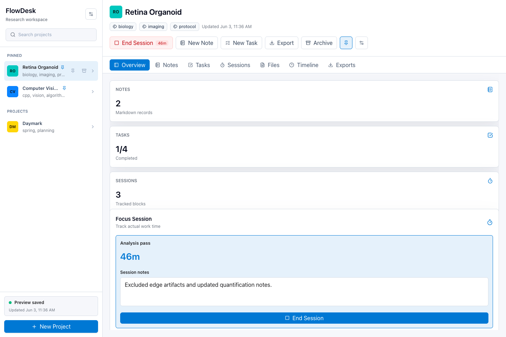
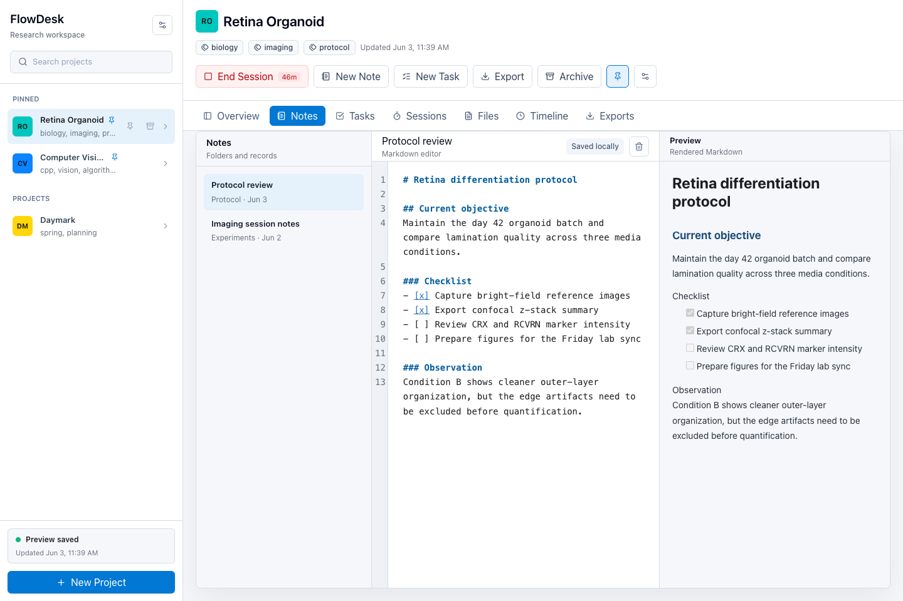
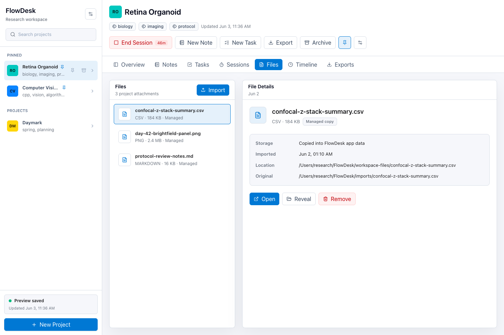
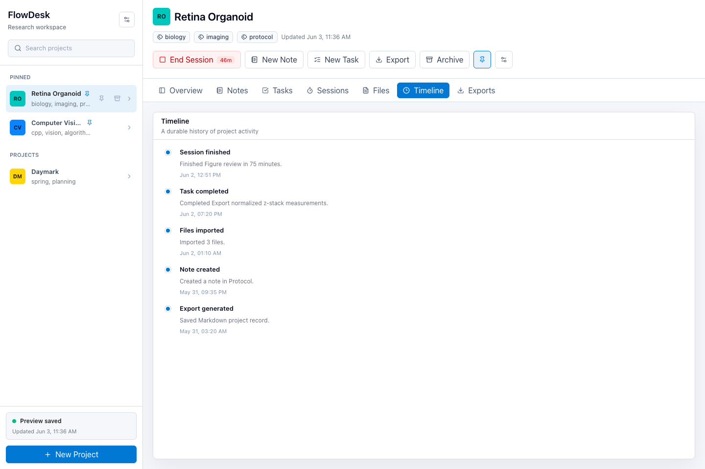

# FlowDesk

FlowDesk는 프로젝트, Markdown 노트, 작업, 작업 세션, 파일, 타임라인, 백업과 내보내기를 한곳에서 관리하는 데스크톱 워크스페이스입니다.

학생, 연구자, 개발자가 긴 호흡의 프로젝트를 진행할 때 필요한 기록 구조와 작업 흐름에 집중합니다. 대형 올인원 문서 도구를 대체하기보다 프로젝트 단위의 정리, 추적, 보관에 초점을 둡니다.

## 다운로드

최신 macOS/Windows 빌드는 GitHub Releases에서 받을 수 있습니다.

- [FlowDesk v0.1.1 다운로드](https://github.com/potterLim/flowdesk/releases/tag/v0.1.1)
- macOS: Apple Silicon/Intel용 DMG
- Windows: MSI 설치 파일과 Setup 실행 파일

현재 공개 릴리스 빌드는 개발자 인증서 기반 배포 서명과 macOS notarization을 적용하지 않은 산출물입니다. macOS Gatekeeper 또는 Windows SmartScreen 경고가 표시될 수 있습니다.

## 스크린샷

### 프로젝트 Overview



### Markdown 노트와 실시간 미리보기



### 파일 관리



### 프로젝트 Timeline



## 주요 기능

- 프로젝트 생성, 고정, 보관, 색상 지정
- Markdown 노트 편집과 렌더링 미리보기
- 작업 생성, 우선순위, 상태 관리
- 작업 세션 시작/종료와 세션 기록
- 파일 가져오기, 열기, Finder/Explorer에서 보기
- 프로젝트 활동 타임라인
- Markdown, JSON 프로젝트 기록 내보내기
- 워크스페이스 백업과 복원
- 진단 정보 내보내기
- macOS/Windows 네이티브 메뉴와 데스크톱 패키징

## 구현 범위

FlowDesk는 데스크톱 워크스페이스의 핵심 흐름을 중심으로 개발되어 있습니다. 프로젝트 생성과 정리, Markdown 노트 작성, 작업과 세션 기록, 파일 관리, 타임라인, 백업/복원, Markdown/JSON 내보내기를 하나의 작업 공간에서 사용할 수 있습니다.

macOS와 Windows 환경에서 빌드, 패키징, 설치, 파일 가져오기/열기, 백업/복원, 내보내기 흐름을 검증했습니다.

## 기술 스택

| 영역      | 기술                       |
| --------- | -------------------------- |
| Desktop   | Tauri 2                    |
| Frontend  | React 19, TypeScript       |
| Styling   | Tailwind CSS               |
| Editor    | CodeMirror                 |
| State     | Zustand                    |
| Routing   | React Router               |
| Database  | SQLite                     |
| Markdown  | react-markdown, remark-gfm |
| Packaging | Tauri bundler              |

## 요구 사항

- Node.js 20 이상
- pnpm
- Rust stable toolchain
- macOS 또는 Windows용 Tauri 2 개발 필수 구성 요소

## 빠른 실행

```bash
pnpm install
pnpm tauri:dev
```

프론트엔드만 확인할 때는 Vite 개발 서버를 실행합니다.

```bash
pnpm dev
```

## 검증

기본 테스트와 빌드:

```bash
pnpm test
pnpm test:stress
pnpm build
cargo test --manifest-path src-tauri/Cargo.toml
```

릴리스 번들 검사:

```bash
pnpm qa:package
```

장시간 백업/내보내기 반복 검증:

```bash
pnpm qa:soak
```

전체 릴리스 검증:

```bash
pnpm qa:release
```

## 패키징과 배포

```bash
pnpm tauri:build
```

빌드 산출물은 `src-tauri/target/release/bundle/` 아래에 생성됩니다.

- macOS: `FlowDesk.app`, `.dmg`
- Windows: `.msi`, NSIS `.exe`

GitHub Actions release workflow는 macOS Apple Silicon, macOS Intel, Windows 빌드를 만들고 draft GitHub Release에 파일을 올립니다.

사용자에게 배포할 산출물은 플랫폼별 신뢰 체계에 맞게 서명합니다.

- macOS: Apple Developer ID 서명과 notarization
- Windows: 코드 서명 인증서와 SmartScreen 평판
- 자동 업데이트를 도입할 경우: Tauri updater 서명 키

서명과 릴리스 환경 변수는 [릴리스 서명 가이드](docs/release-signing.md)에 정리되어 있습니다.

인증서, private key, 앱 전용 비밀번호, CI secret은 로컬 셸 세션, macOS Keychain, Windows 인증서 저장소, 1Password, GitHub Actions secret 같은 비밀 관리 경로에만 보관합니다. 실제 secret 값은 `.env`, README, 스크립트, Git 커밋에 남기지 않습니다.

## 데이터와 개인정보

FlowDesk 데이터는 사용자의 로컬 앱 데이터 디렉터리에 저장됩니다. 프로젝트 기록, 노트, 작업, 세션, 참고자료, 파일 메타데이터는 SQLite에 저장합니다. 데스크톱 앱에서 새로 가져온 파일은 관리형 로컬 폴더에 복사하고 원본 경로와 저장 모드는 메타데이터로 함께 기록합니다.

현재 버전에는 클라우드 동기화나 외부 서버 전송 기능이 없습니다. 백업, 복원, Markdown/JSON 내보내기는 사용자가 선택한 로컬 파일을 기준으로 동작합니다.

## 저장 구조

FlowDesk의 데스크톱 데이터는 사용자의 앱 데이터 디렉터리 아래에 저장됩니다.

```text
com.flowdesk.desktop/
├─ flowdesk.db
└─ workspace-files/
```

- `flowdesk.db`: 프로젝트, 노트, 작업, 세션, 참고자료, 타임라인, 파일 메타데이터를 저장하는 SQLite 데이터베이스
- `workspace-files/`: 가져온 PDF, 이미지, CSV, 텍스트, Markdown 파일의 관리형 복사본

SQLite에는 파일 본문이 아니라 파일명, 타입, 크기, 경로, 원본 경로, 저장 모드 같은 메타데이터를 저장합니다. 실제 파일은 로컬 파일 시스템에 저장합니다.

## 코드 구조

```text
flowdesk/
├─ src/
│  ├─ app/
│  ├─ components/
│  ├─ domain/
│  ├─ features/
│  │  └─ workspace/
│  ├─ lib/
│  │  ├─ backup/
│  │  ├─ diagnostics/
│  │  ├─ export/
│  │  ├─ persistence/
│  │  └─ platform/
│  ├─ stores/
│  └─ styles/
├─ src-tauri/
│  ├─ src/
│  ├─ icons/
│  ├─ capabilities/
│  └─ tauri.conf.json
├─ database/
│  └─ migrations/
├─ assets/
│  └─ screenshots/
└─ scripts/
   └─ qa/
```

`src/`는 React 애플리케이션과 프론트엔드 도메인 로직을 담고, `src-tauri/`는 Tauri/Rust 런타임, 메뉴, 데이터베이스 명령, 진단 명령을 담당합니다.
`database/migrations/`는 SQL 기준 스냅샷을 담고, 앱 런타임 마이그레이션은 `src/lib/persistence/workspaceMigrations.ts`에서 관리합니다.

## 설계 방향

- 데스크톱 앱다운 빠른 실행과 네이티브 흐름
- 프로젝트 중심의 구조화된 기록
- 장기 프로젝트에 적합한 노트, 작업, 세션, 파일 관리
- 독립적으로 보관할 수 있는 Markdown/JSON 내보내기
- 과도한 장식보다 명확한 정보 밀도와 조작감

FlowDesk는 클라우드 협업이나 AI 자동화보다 개인 데스크톱에서의 정리, 기록, 회고, 보관에 집중합니다. 프로젝트별로 노트, 작업, 세션, 파일, 내보내기 기록이 자연스럽게 묶이는 흐름을 우선합니다.

## 로드맵

- 검색과 필터링 경험 고도화
- 참고자료 관리 흐름 확장
- 장기 프로젝트 타임라인 개선
- 백업/복구 경험 강화
- 접근성 및 키보드 사용성 개선
- macOS와 Windows 배포 경험 개선

## 참고 문서

- [Tauri macOS code signing](https://v2.tauri.app/distribute/sign/macos/)
- [Tauri Windows code signing](https://v2.tauri.app/distribute/sign/windows/)
- [Tauri environment variables](https://v2.tauri.app/reference/environment-variables/)
- [Tauri updater](https://v2.tauri.app/plugin/updater/)
